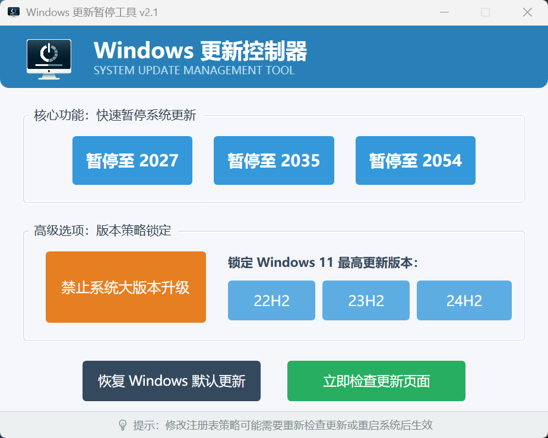

# Windows 更新一键暂停工具 (Clean Version)

这是一款绿色免安装的 Windows 10/11 更新控制工具。通过修改系统组策略与注册表，让您找回系统更新的“自主控制权”。

**本版本为纯净增强版：** 彻底移除原版广告与个人信息，修复编译 Bug，视觉体验更佳，功能更稳定。

---

### 📥 软件下载

*   **[直接下载绿色版 (夸克网盘)](https://pan.quark.cn/s/d9e177d518d1)**
*   **[GitHub Releases 页面](https://github.com/MasterLii/Windows-Update-Delayer-Clean/releases/tag/v2.1)**

---

### ✨ 核心功能

- **🚀 长期暂停更新**：支持一键暂停至 2027 (新)、2035 或 2054 年。
- **🔒 版本锁定**：锁定 Win11 至特定版本 (22H2/23H2/24H2)，防止偷偷升级。
- **🚫 禁止大版本升级**：例如防止 Windows 10 强制推送并升级到 Windows 11。
- **🔄 一键恢复**：随时一键清理所有策略，恢复系统原生更新状态。

---

### 💎 本版优化

1.  **极简界面**：移除所有推广链接、头像与无关信息，界面更清爽。
2.  **功能升级**：将原版过期的 2026 年选项延长至 **2027 年**。
3.  **视觉重构**：采用现代科技蓝主题，增加按钮悬停与点击反馈效果。
4.  **布局优化**：修复提示文字遮挡按钮的 Bug，排版更合理。
5.  **编译修复**：修复了原版源码无法直接通过 MSBuild 编译的问题。

---

### 🚀 快速使用

1.  **下载**：下载 `Windows一键暂停更新.exe`。
2.  **运行**：**必须右键选择“以管理员身份运行”**。
3.  **操作**：根据需要点击按钮，修改后建议重启系统以完全生效。

---

### 🙏 项目致谢

本项目基于开源项目 [Windows-Update-Delayer](https://github.com/IT-HaoGe/Windows-Update-Delayer) 修改。

---

### 🌐 更多实用资源

*   **[星系资源网](https://www.sharezy.xyz/)**

---

### ⚖️ 免责声明

本工具通过修改系统策略实现。使用前请悉知相关影响，本人不对因关闭更新导致的系统安全或稳定性问题负责。

---

**如果帮到了您，请点击右上角给个 Star ⭐️ 吧！**
